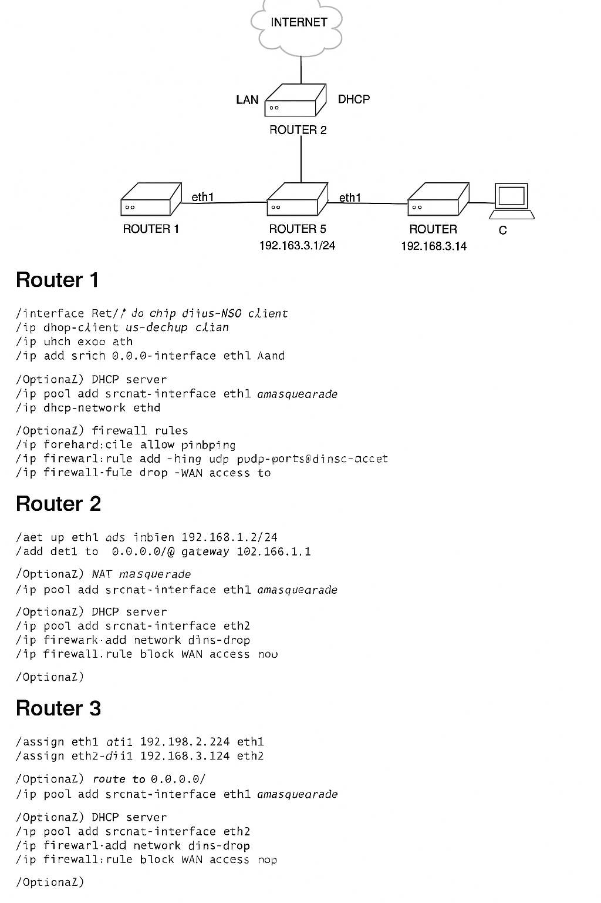

# test-3-microtic-routers

# 🌐 MikroTik Triple NAT Router Setup

This project provides a **complete MikroTik router configuration** for setting up a triple-router NAT scenario. It is useful for learning, labs, and nested network simulations.

---

## 🗺️ Network Topology



---

## 🔧 Router 1 – Edge Router

This router connects directly to the internet via DHCP. It provides internet access to Router 2 and its downstream clients.

```bash
/interface ethernet
set [find default-name=ether1] name=eth1
set [find default-name=ether2] name=eth2

/ip dhcp-client
add interface=eth1 use-peer-dns=yes add-default-route=yes

/ip address
add address=192.168.1.1/24 interface=eth2 network=192.168.1.0

/ip firewall nat
add chain=srcnat out-interface=eth1 action=masquerade

/ip pool
add name=dhcp_pool1 ranges=192.168.1.10-192.168.1.100

/ip dhcp-server
add name=dhcp1 interface=eth2 address-pool=dhcp_pool1 lease-time=1h disabled=no

/ip dhcp-server network
add address=192.168.1.0/24 gateway=192.168.1.1 dns-server=8.8.8.8

/ip dns
set allow-remote-requests=yes servers=8.8.8.8

/ip firewall filter
add chain=input protocol=icmp action=accept comment="Allow ping"
add chain=input protocol=udp port=53 action=accept comment="Allow DNS"
add chain=input connection-state=established,related action=accept
add chain=input connection-state=invalid action=drop
add chain=input in-interface=eth1 action=drop comment="Block WAN access to router"
```

---

## 🧩 Router 2 – Mid Router

Router 2 gets internet via Router 1 and serves Router 3 through another NAT.

```bash
/interface ethernet
set [find default-name=ether1] name=eth1
set [find default-name=ether2] name=eth2

/ip address
add address=192.168.1.2/24 interface=eth1
add address=192.168.2.1/24 interface=eth2

/ip route
add dst-address=0.0.0.0/0 gateway=192.168.1.1

/ip firewall nat
add chain=srcnat out-interface=eth1 action=masquerade

/ip pool
add name=dhcp_pool2 ranges=192.168.2.10-192.168.2.100

/ip dhcp-server
add name=dhcp2 interface=eth2 address-pool=dhcp_pool2 lease-time=1h disabled=no

/ip dhcp-server network
add address=192.168.2.0/24 gateway=192.168.2.1 dns-server=8.8.8.8

/ip firewall filter
add chain=input protocol=icmp action=accept
add chain=input connection-state=established,related action=accept
add chain=input connection-state=invalid action=drop
add chain=input in-interface=eth1 action=drop
```

---

## 🧱 Router 3 – Internal LAN Router

Final router, provides NAT to the LAN clients behind it.

```bash
/interface ethernet
set [find default-name=ether1] name=eth1
set [find default-name=ether2] name=eth2

/ip address
add address=192.168.2.2/24 interface=eth1
add address=192.168.3.1/24 interface=eth2

/ip route
add dst-address=0.0.0.0/0 gateway=192.168.2.1

/ip firewall nat
add chain=srcnat out-interface=eth1 action=masquerade

/ip pool
add name=dhcp_pool3 ranges=192.168.3.10-192.168.3.100

/ip dhcp-server
add name=dhcp3 interface=eth2 address-pool=dhcp_pool3 lease-time=1h disabled=no

/ip dhcp-server network
add address=192.168.3.0/24 gateway=192.168.3.1 dns-server=8.8.8.8

/ip firewall filter
add chain=input protocol=icmp action=accept
add chain=input connection-state=established,related action=accept
add chain=input connection-state=invalid action=drop
add chain=input in-interface=eth1 action=drop
```

---

## 🧪 Test Procedure

From a client connected to Router 3 (e.g., 192.168.3.100):

```bash
ping 192.168.3.1       # Gateway of Router 3
ping 192.168.2.1       # Router 2 LAN
ping 192.168.1.1       # Router 1 LAN
ping 8.8.8.8           # Internet Test
```

---

## 💡 Tips

- Each router is isolated with NAT, which makes tracing issues simple but limits end-to-end visibility.
- You can disable NAT and set static routes for full internal visibility (routing-only setup).
- Remote access and VPN configs can be added in production scenarios.

---

## 📜 License

MIT License – Free to use and modify.

---

## 🧷 Files Included

- `A_detailed_network_diagram_and_configuration_guide.png` – PNG diagram
- `MikroTik_Triple_Router_Setup.md` – This Markdown file
